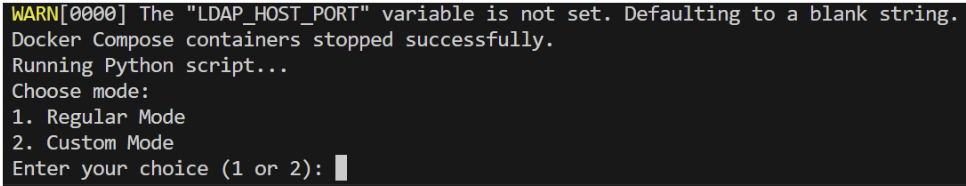
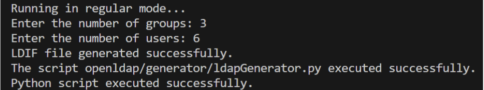
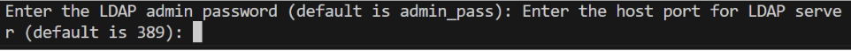
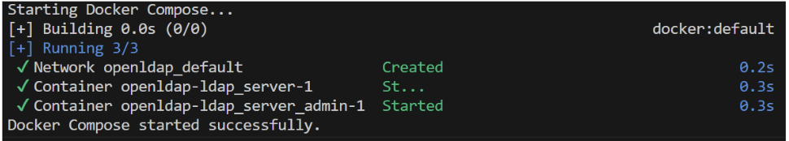

# Deceptive LDAP server generator

This is the final project in the course 97430 - CYBERSECURITY M. This project aims to create a fake LDAP server that can serve as a defence mechanism against attackers by diverting their attention from real targets. 

## Installation

To run this project you need a working version of Python. Python can be downloaded [here](https://www.python.org/downloads/).

## Usage

1. Navigate to the Project folder (BigChungusLDAP).  

### Running the Setup Script

1. Navigate to the "BigChungusLDAP" folder.

2. Run setup script:

- If you have a Windows-based operating system, write "./setup.bat"
- If you have a Linux-based operating system, write "./setup.sh"

This script will stop existing Docker containers and prompt you to choose between **Regular mode** and **Custom mode**.

#### Regular Mode

1. Choose "1" in the terminal to run regular mode.

2. Enter the desired number of group and user entries for the LDAP server when prompted.

**Regular Mode Screenshot**





3. The ldapGenerator.py script generates an LDIF file containing the specified group and user entries, utilizing the Faker library to add auto-generated data to user entries.


4. Set the LDAP admin password and the host port for the LDAP server when prompted.



5. The docker-compose.yaml script is executed, providing the LDIF file to the slapd service, which configures the LDAP server.



#### Custom Mode

1. Choose "2" in the terminal to run custom mode.

2. Insert the path to your custom LDIF file when prompted. The content of this file will replace the default bootstrap.ldif file.

3. Continue by setting the LDAP admin credentials and host port as usual.

#### Verifying Data Population

To verify data population in the LDAP server, you can use the following commands in the terminal:

- Verify a user entry:

```
ldapsearch -x -LLL -H ldap://localhost:389 -D "cn=admin,dc=example,dc=org" -W -b "dc=example,dc=org" "(uid=colliershane)"
```

Replace "colliershane" with the desired username.

- Verify a group entry:

```
ldapsearch -x -LLL -H ldap://localhost:389 -D "cn=admin,dc=example,dc=org" -W -b "dc=example,dc=org" "(cn=Group2)"
```

Replace "Group2" with the desired group name.

The commands search for entries in the server based on the provided criteria and prompt for the admin password. If the entry exists, it will be displayed in the output.

**LDAP Search Screenshot**
